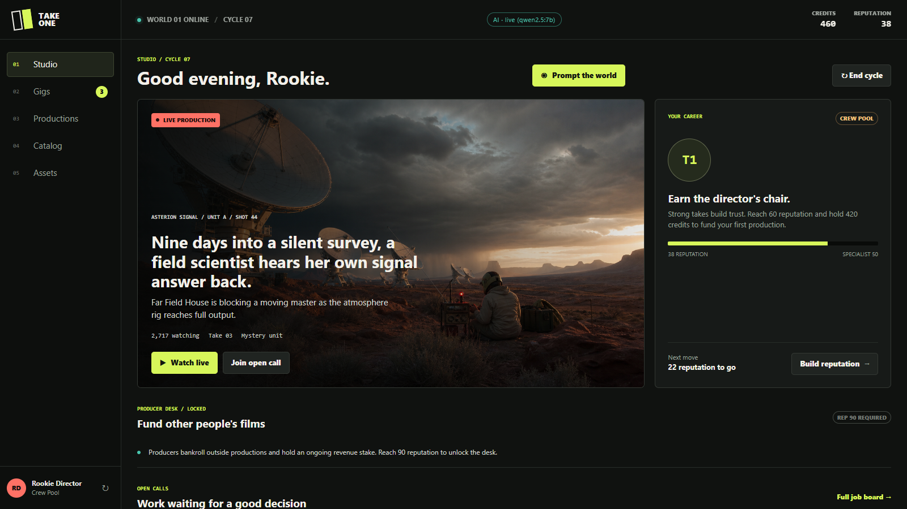
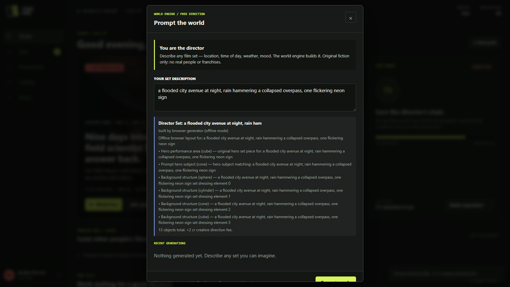

# 🎬 Take One — AI Production House

> A playable AI filmmaking game: **direct films in your browser**, generate sets, cast, and story with a **local LLM**, build them as **real 3D sets in Unreal Engine 5.8**, shoot them, and publish to a shared world catalog — **100% free, no paid APIs**.

   -8A2BE2) 

---

## 📸 What it looks like



**Prompt the world engine** with any set description — a local LLM designs it:



## 🎮 The game

You don't play *a* movie — you **run a production house**:

| Stage | What you do |
|---|---|
| 🎭 **Take gigs** | Actor, Writer, Set Crew, Drone Op, Videographer, VFX — creative briefs + a timing-based execution minigame |
| 📈 **Build reputation** | Scores earn credits + reputation; **flops are real** — score under 50 and crews pay you less until you recover |
| 🪑 **Greenlight (rep 60)** | Pick a script, hire specialist crew, make 4 creative calls — or **improvise your own directions** and let the AI rate them |
| 🧠 **Direct the set** | Your cast has **persistent personalities** — give performance notes and a local LLM writes their in-character lines |
| 🌍 **Release** | Films earn **per-cycle residuals**; ratings feed audience scores; the shared world sees and rates your work |
| 💼 **Produce (rep 90)** | Bankroll other productions, hold revenue stakes, absorb the risk |

## 🤖 The AI (all local, all free)

Every AI feature runs on **your machine** via [Ollama](https://ollama.com) — no API keys, no cloud bills:

- **Set generation** — describe any location; the model designs a buildable set (validated against a versioned JSON schema)
- **Persistent-personality cast** — original performers who stay in character across scenes
- **Adaptive story beats** — your free-text direction becomes shot notes with a quality rating
- **Object refinement** — key set pieces decompose into dressed compound geometry (lamp = pole + shade + glowing bulb)

**No model? No problem.** Deterministic fallback generators keep every feature playable offline.

## 🏗️ Architecture

```
Browser game ─┐
              ├─► ai-scene-service.mjs ──► local LLM (Ollama) or templates
Unreal 5.8 ───┘        │  validates & clamps every response into
   ▲                   │  ServiceContract/scene-generation.schema.json
   │ R = shoot moving  └─► /v1/jobs queue: web enqueues, UE claims & builds
   │   master (12 frames)
   └──── /v1/films/shots → FFmpeg → the catalog plays real MP4s
```

**Design rule:** the AI executes, it never authors. Game logic never talks to a
model provider directly — the schema contract keeps both clients safe from bad
model output. Original IP only; no real-person likenesses.

## 🚀 Quick start

```powershell
git clone https://github.com/Hamza-32/take-one.git
cd take-one

# AI adapter (recommended — leave running)
node Unreal/TakeOne/Tools/ai-scene-service.mjs

# Play
start index.html
```

**Optional — live LLM generation:**
```powershell
ollama pull qwen2.5:7b
$env:TAKEONE_LLM_BASE_URL = "http://127.0.0.1:11434/v1"
$env:TAKEONE_LLM_API_KEY  = "ollama"
$env:TAKEONE_LLM_MODEL    = "qwen2.5:7b"
node Unreal/TakeOne/Tools/ai-scene-service.mjs
```

**Optional — Unreal 3D sets & film video:** open `Unreal/TakeOne/TakeOne.uproject`
with UE 5.8, press Play, then use **Build in Unreal** in the web game and **`R`**
in-engine to shoot your film. FFmpeg (`winget install Gyan.FFmpeg`) enables MP4 encoding.

📄 Full setup, gameplay walkthrough, and troubleshooting: **[PLAY_GUIDE.md](PLAY_GUIDE.md)**

## 📋 Requirements

| Component | Required for |
|---|---|
| Node.js 18+ | AI adapter |
| Modern browser | Playing the game |
| [Ollama](https://ollama.com) | Live LLM generation (optional) |
| Unreal Engine 5.8 | 3D set slice (optional) |
| FFmpeg | MP4 film encoding (optional) |

## 🗺️ Roadmap

- [x] Career loop: gigs → director → producer, residuals, flop consequences
- [x] Local-LLM generation: sets, cast, dialogue, story beats
- [x] UE 5.8 set construction + performers + moving-master capture
- [x] FFmpeg film encoding, shared world catalog with cross-player ratings
- [ ] True mesh generation (Hunyuan3D/TRELLIS seam ready — needs a local GPU)
- [ ] Sequenced shots via Movie Render Queue
- [ ] Live co-presence multiplayer

See [PROJECT_STATUS.md](PROJECT_STATUS.md) for the full implementation checklist.

## 🤝 Contributing

PRs welcome — read [CONTRIBUTING.md](CONTRIBUTING.md) first (short version: the
AI executes, never authors; original IP only; clamp everything server-side).

## 📄 License

[MIT](LICENSE)
